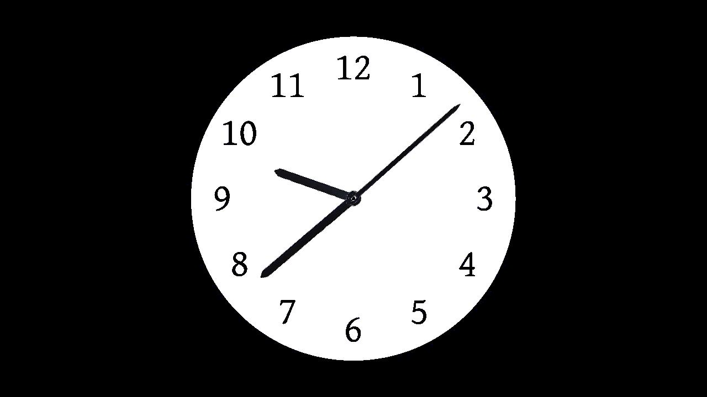

# Roku Draw2d Rotation Example

> This project was created using [`npx create-roku-app`](https://github.com/haystacknews/create-roku-app)

This is an example app to show how rotation of images can be accomplished using Roku's Draw2d API.

In order to rotate an image from a point different than the top-left corner, you need to create an `roRegion` of the image/bitmap.

Then, apply a `pretranslation` to the region, which is basically a translation so the point of rotation would be in the top-left corner.

For example, if the image (`image.png`) was 300px wide x 200px tall, and you wanted to rotate the image 180 degrees at the centre, you'd have to pretranslate by (-150, -100):

```brs
screen = CreateObject("roScreen", 1280, 720)
imageBitmap = CreateObject("roBitmap", "pkg:/images/image.png")
imageRegion = CreateObject("roRegion", imageBitmap, 0, 0, 300, 200)
imageRegion.SetPretranslation(-150, -100)

screen.drawRotatedObject(500, 400, 180, imageRegion)
screen.swapBuffers()
```

One thing to note is that the pretranslation is now applied to the region when it is drawn as well, so in the above example, the center of the image will be at the (500, 400) point of the screen.

## Clock Example

The example app is a clock, with hands that rotate based on the current time. Each clock-hand image is pretranslated so it will rotate properly around the middle of the clock face.



## Before you start

1. Install the project dependencies (`npm install`) if you haven't done that yet.

1. Open the `bsconfig.json` file and enter the password for your Roku device.

1. Optionally you can hardcode your Roku device's IP in the `host` field. If you do so make sure to remove the `host` entry from the `.vscode/launch.json` settings.

## Launching your app

> This project assumes that you will be using VSCode as your code editor.

1. Go to the `Run and Debug` panel.

1. Select the option `Launch (dev)`

## NPM Commands available

- `build`: Builds your project with [`brighterscript`](https://github.com/rokucommunity/brighterscript). Includes source maps.

- `build:prod`: Builds your project without source maps.

- `lint`: Lints your source files with [`@rokucommunity/bslint`](https://github.com/rokucommunity/bslint)

- `lint:fix`: Lints your source files and applies automatic fixes.

## Attributions

- `tick.wav` and `tock.wav` are modified from `Wall Clock Ticking.wav` by straget, from https://freesound.org/people/straget/sounds/405423/
